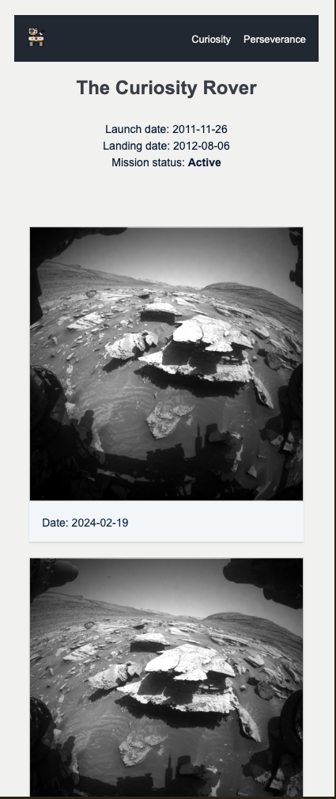
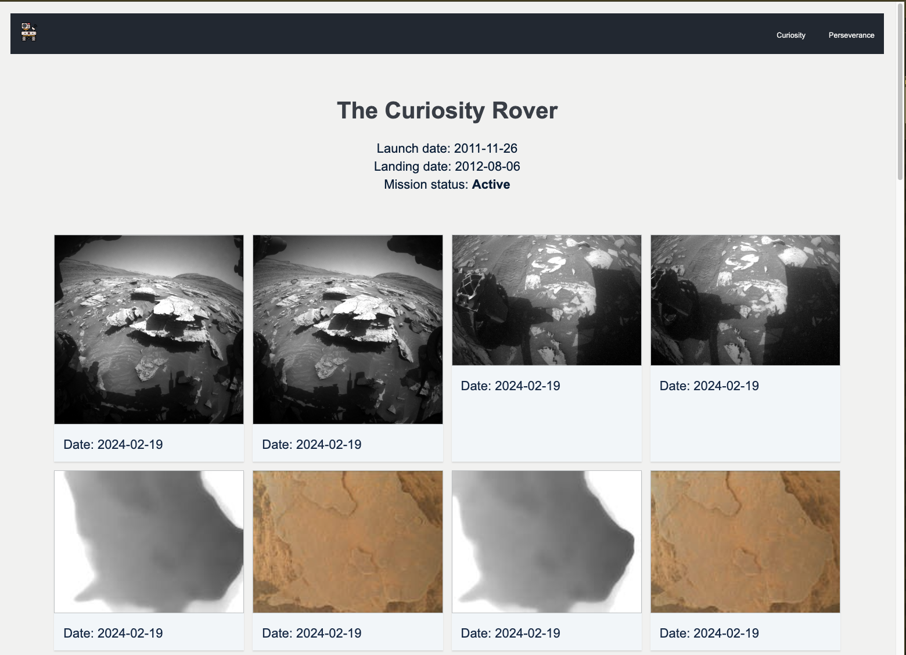

# Functional Programming with Javascript 

## Student Instructions

### Big Picture

You are going to create a Mars rover dashboard that consumes the NASA API. Your dashboard will allow the user to select which rover's information they want to view. Once they have selected a rover, they will be able to see the most recent images taken by that rover, as well as important information about the rover and its mission. Your app will make use of all the functional concepts and practices you have learned in this course, and the goal is that you would become very comfortable using pure functions and iterating over, reshaping, and accessing information from complex API responses. 

### Getting Started

We have supplied some of the foundational code for you. So follow these steps to get started:

1. We'll start with the typical setup - clone theis repo and install the dependencies

 - [x] To clone the repo, remember to clone just the starter branch:

```git clone --single-branch --branch starter <repo-name>```

 - [x] For this project we are using yarn as our package manager, so to install your depencies run:

```yarn install``` 

**If you don’t have yarn installed globally, follow their installation documentation here according to your operating system: https://yarnpkg.com/lang/en/docs/install

2. Next you'll need a NASA developer API key in order to access the API endpoints. To do that, go here: https://api.nasa.gov/. If you want to simply look around at what api endpoints NASA offers, you can use their provided DEMO_KEY to do this.

3. In your repo, you will see a .env-example file with a place for your API key. Rename or copy the file to one called `.env` and enter in your key. Now that you have your key, just remember to add it as a parameter to every request you make to NASA.

5. Run `yarn start` in your terminal and go to `http:localhost:3000` to check that your app is working. If you don't see an image on the page, check that your api key is set up correctly.

6. Remember to commit frequently, use branches, and leave good commit messages! You'll thank yourself later.

### Project Requirements

To complete this project, your UI must show the following:

- [x] A gallery of the most recent images sent from each mars rover
- [x] The launch date, landing date, name and status along with any other information about the rover
- [x] A selection bar for the user to choose which rover's information they want to see

To complete this project, your UI must do the following:

- [x] Be responsive. Needs to look good(aka not broken) on phones(max width 768px) and desktop(min-width 991px, max-width 1824px). Tablet view is optional.
- [x] Provide a way to dynamically switch the UI to view one of the three rovers 
**This can be done using tabs, buttons, or any other UI control

To complete this project, your frontend code must:

- [x] Use only pure functions
- [x] Use at least one Higher Order Function
- [x] Use the array method `map`
- [x] Use the ImmutableJS library

To complete this project, your backend code must:

- [x] Be built with Node/Express
- [x] Make successful calls to the NASA API
- [x] Use pure functions to do any logic necessary
- [x] Hide any sensetive information from public view (In other words, use your dotenv file)

### Above and Beyond

The NASA API has a lot more data to offer than what we are using here. There's no extra credit in this course, but it could be fun explore their API and see what they have to offer and what strikes your creativity to add into your project. You are not limited to the API calls we require. Look here (https://api.nasa.gov/ at the Browse API's section) to see all that's available.

Some ideas might be to incorporate the Astronomy Photo of the Day into your design, collect weather information on Mars, etc...

### Design

Create an image gallery slider, put a full page background image, code some falling asteroids with css animations ... the visual design of this UI is up to you! There is a lot of awesome dashboard design inspiration out there. You have already been given a good start with a mobile-first stylesheet already set up for you. 

### Screenshot






